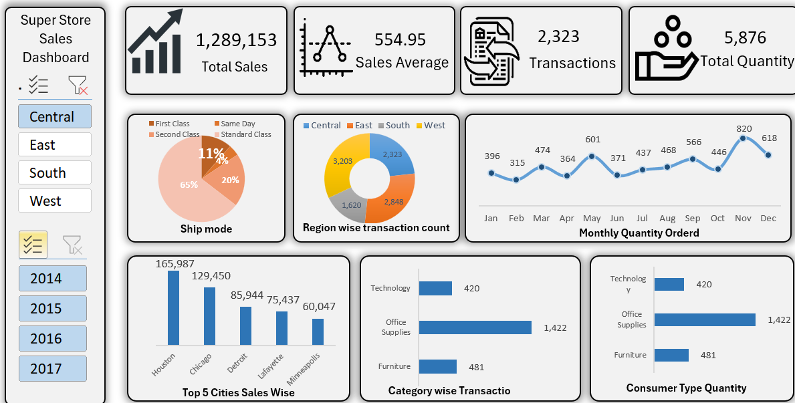

# SuperStore Sales Dashboard – Excel

## 🎥 Dashboard Demo

*A short walkthrough demonstrating the Excel dashboard, Power Query workflow, analysis and dynamic slicers.*

## 📊 Project Overview

An interactive SuperStore Sales Dashboard built entirely in Microsoft Excel.

This project demonstrates the complete workflow of transforming raw transactional data into meaningful business insights using Power Query, Pivot Tables, Excel charts, KPIs and interactive slicers.

## 🎯 Project Objective

The objective of this project was to analyse SuperStore sales data and create an interactive dashboard for exploring sales performance, transactions, quantity and regional trends.

## 🛠️ Tools & Techniques Used

- Microsoft Excel
- Power Query
- Pivot Tables
- Excel Charts
- Slicers
- Data Cleaning & Transformation
- Data Analysis
- Dashboard Design

## 🔄 Project Workflow

**Raw Data → Power Query → Data Preparation → Pivot Analysis → KPIs & Visualizations → Interactive Dashboard**

## 📁 Dataset

The project uses dummy/simulated SuperStore transactional data containing **9,994 records and 19 fields**.

The dataset includes information related to:

- Orders and order dates
- Shipping details
- Customers
- Customer segments
- Cities and regions
- Products
- Categories and sub-categories
- Quantity and sales-related information

## 📈 Key Performance Indicators

The dashboard provides four primary KPIs:

- **Total Sales:** 
- **Sales Average:**
- **Transactions:** 
- **Total Quantity:** 

These KPIs dynamically update based on the selected **Region** and **Year** slicers.

## 📊 Dashboard Visualizations

The dashboard includes:

### Ship Mode Analysis
Breakdown of transactions by shipping mode.

### Region-wise Transaction Count
Comparison of transactions across Central, East, South and West regions.

### Monthly Quantity Trend
Monthly analysis of ordered quantity.

### Top 5 Cities by Sales
Comparison of sales performance across the top five cities.

### Category-wise Transactions
Transaction analysis across Technology, Office Supplies and Furniture.

### Customer Segment Quantity
Quantity analysis across Consumer, Corporate and Home Office segments.

## 🎛️ Interactive Slicers

The dashboard includes dynamic slicers for:

### Region
- Central
- East
- South
- West

### Year
- 2014
- 2015
- 2016
- 2017

Selecting different combinations of Region and Year dynamically updates the dashboard KPIs and visualizations.

## 📂 Project Files

| File | Description |
|---|---|
| `SuperStore_Sales_Dashboard.xlsx` | Final Excel dashboard and analysis |
| `Superstore_Raw_Data.xlsx` | Dummy/raw transactional dataset |
| `screenshots/Dashboard.png` | Dashboard preview |
| `demo/SuperStore_Dashboard_Demo.mp4` | Dashboard walkthrough video |

## 🎥 Dashboard Demo

▶️ **[Watch the Dashboard Demo](demo/SuperStore_Dashboard_Demo.mp4)**

A short screen recording demonstrates the complete workflow from the source data and analysis to the final interactive dashboard.

The demonstration also shows how the Region and Year slicers dynamically update the dashboard.

## 📚 Learning Journey

This project was developed as part of my learning journey with **Satish Dhawale / Skill Course**.

The project provided hands-on practice in data preparation, Power Query, Pivot Tables, data analysis, visualization and interactive Excel dashboard development.

## 🚀 Next Step

This project is the foundation of my data analytics learning journey.

**Next project → Microsoft Power BI**

I plan to build on the concepts learned through Excel, Power Query and data analysis to develop an interactive Power BI project.

---

**Tools:** Microsoft Excel | Power Query | Pivot Tables | Data Visualization | Slicers
